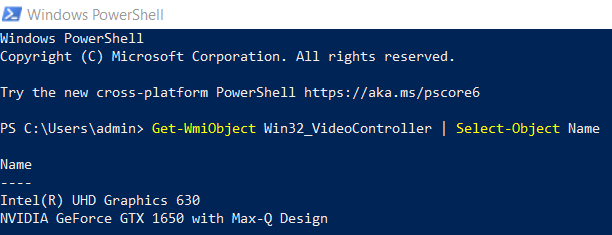
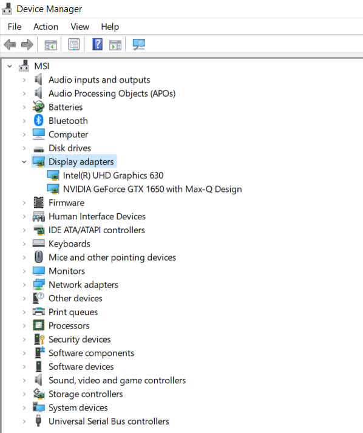

# CUDA Setup Guide for Windows

Complete step-by-step instructions to set up your Windows machine for CUDA development and run all examples in this repository.

---

## Table of Contents

1. [Prerequisites](#prerequisites)
2. [Step 1: Check Your GPU](#step-1-check-your-gpu)
3. [Step 2: Install NVIDIA GPU Driver](#step-2-install-nvidia-gpu-driver)
4. [Step 3: Install Visual Studio](#step-3-install-visual-studio)
5. [Step 4: Install CUDA Toolkit](#step-4-install-cuda-toolkit)
6. [Step 5: Verify Installation](#step-5-verify-installation)
7. [Step 6: Compile and Run CUDA Code](#step-6-compile-and-run-cuda-code)
8. [Troubleshooting](#troubleshooting)

---

## Prerequisites

Before you begin, ensure you have:

- **Windows 10 or 11** (64-bit)
- **NVIDIA GPU** (GeForce, Quadro, or Tesla series)
- **Administrator access** to your computer
- **~10 GB free disk space** for installations

---

## Step 1: Check Your GPU

First, verify you have an NVIDIA GPU that supports CUDA.

### Option A: Using Task Manager

1. Press `Ctrl + Shift + Esc` to open Task Manager
2. Click on the **Performance** tab
3. Look for **GPU** in the left panel
4. Check if it shows "NVIDIA" in the GPU name

### Option B: Using PowerShell

Open PowerShell and run:

```powershell
Get-WmiObject Win32_VideoController | Select-Object Name
```

You should see something like:

```
Name
----
Intel(R) UHD Graphics 630
NVIDIA GeForce GTX 1650 with Max-Q Design
```



> **Multiple GPUs?** Many laptops have both Intel integrated graphics and an NVIDIA discrete GPU. CUDA will use the NVIDIA GPU.

### Option C: Using Device Manager

1. Press `Win + X` and select **Device Manager**
2. Expand **Display adapters**
3. Look for your NVIDIA GPU



> **No NVIDIA GPU?** CUDA requires an NVIDIA GPU. If you have AMD or Intel graphics, CUDA won't work on your system.

---

## Step 2: Install NVIDIA GPU Driver

You need the latest NVIDIA driver for your GPU.

### Download Driver

1. Go to [NVIDIA Driver Downloads](https://www.nvidia.com/Download/index.aspx)
2. Select your GPU:
   - **Product Type**: GeForce (or Quadro/Tesla)
   - **Product Series**: Your series (e.g., GeForce RTX 30 Series)
   - **Product**: Your specific GPU (e.g., GeForce RTX 3080)
   - **Operating System**: Windows 10/11 64-bit
   - **Download Type**: Game Ready Driver (or Studio Driver)
3. Click **Search** → **Download**
4. Run the installer and follow the prompts

### Verify Driver Installation

Open PowerShell and run:

```powershell
nvidia-smi
```

You should see output like:

```
+---------------------------------------------------------------------------------------+
| NVIDIA-SMI 545.84                 Driver Version: 545.84       CUDA Version: 12.3     |
|-----------------------------------------+----------------------+----------------------+
| GPU  Name                     TCC/WDDM  | Bus-Id        Disp.A | Volatile Uncorr. ECC |
| Fan  Temp   Perf          Pwr:Usage/Cap |         Memory-Usage | GPU-Util  Compute M. |
|                                         |                      |               MIG M. |
|=========================================+======================+======================|
|   0  NVIDIA GeForce GTX 1650 ...  WDDM  | 00000000:01:00.0 Off |                  N/A |
| N/A   48C    P0              13W /  35W |      0MiB /  4096MiB |      0%      Default |
|                                         |                      |                  N/A |
+-----------------------------------------+----------------------+----------------------+
```

> Note the **CUDA Version** shown (12.3) - this is the maximum CUDA version your driver supports. Install this version or lower.

---

## Step 3: Install Visual Studio

CUDA requires a C++ compiler. On Windows, this means Visual Studio or Visual Studio Build Tools.

> **Supported Versions**: CUDA works with Visual Studio **2017**, **2019**, and **2022**. Any of these will work. This guide uses **VS 2019 Build Tools** as an example.

### Option A: Visual Studio Build Tools (Lightweight - Recommended)

If you only need the compiler without the full IDE:

1. Go to [Visual Studio Downloads](https://visualstudio.microsoft.com/downloads/)
2. Scroll down to **Tools for Visual Studio**
3. Download **Build Tools for Visual Studio** (2019, 2022, or your preferred version)
4. Run the installer
5. Select: ✅ **Desktop development with C++**
6. Click **Install**

### Option B: Visual Studio Community (Full IDE)

If you want the complete IDE with editor, debugger, and IntelliSense:

1. Go to [Visual Studio Downloads](https://visualstudio.microsoft.com/downloads/)
2. Download **Visual Studio Community** (2019, 2022, or your preferred version - free)
3. In the **Workloads** tab, select:
   - ✅ **Desktop development with C++**
4. Click **Install**

> This may take 15-30 minutes depending on your internet speed.

### Verify Installation

Open **Developer Command Prompt for VS** (search "Developer Command Prompt" in Start menu) and run:

```
cl
```

You should see output similar to this (version numbers will vary based on your VS version):

```
**********************************************************************
** Visual Studio 2019 Developer Command Prompt v16.11.48
** Copyright (c) 2021 Microsoft Corporation
**********************************************************************

Microsoft (R) C/C++ Optimizing Compiler Version 19.29.30159 for x86
Copyright (C) Microsoft Corporation.  All rights reserved.

usage: cl [ option... ] filename... [ /link linkoption... ]
```

| VS Version | Compiler Version | Example |
|------------|------------------|---------|
| VS 2017 | 19.1x.xxxxx | `Version 19.16.27045` |
| VS 2019 | 19.2x.xxxxx | `Version 19.29.30159` ✓ (used in this guide) |
| VS 2022 | 19.3x.xxxxx | `Version 19.38.33130` |

---

## Step 4: Install CUDA Toolkit

### Download CUDA Toolkit

1. Go to [CUDA Toolkit Downloads](https://developer.nvidia.com/cuda-downloads)
2. Select:
   - **Operating System**: Windows
   - **Architecture**: x86_64
   - **Version**: 10 or 11
   - **Installer Type**: exe (local) - recommended for reliability
3. Click **Download**

> **Which version?** Use CUDA 12.x for latest features, or CUDA 11.8 for broader compatibility. Check the CUDA Version from `nvidia-smi` - install that version or lower.

### Run the Installer

1. Run the downloaded `.exe` file
2. Choose **Custom** installation
3. Select components:
   - ✅ **CUDA** → Development → Compiler → nvcc
   - ✅ **CUDA** → Development → Libraries
   - ✅ **CUDA** → Runtime
   - ✅ **CUDA** → Documentation (optional)
   - ✅ **CUDA** → Samples (optional but helpful)
4. Accept default installation paths:
   - Default: `C:\Program Files\NVIDIA GPU Computing Toolkit\CUDA\v12.x`
5. Click **Install**

### Set Environment Variables

The installer usually sets these automatically, but verify:

1. Press `Win + R`, type `sysdm.cpl`, press Enter
2. Go to **Advanced** tab → **Environment Variables**
3. Under **System variables**, verify:
   - `CUDA_PATH` = `C:\Program Files\NVIDIA GPU Computing Toolkit\CUDA\v12.x`
   - `CUDA_PATH_V12_x` = `C:\Program Files\NVIDIA GPU Computing Toolkit\CUDA\v12.x`
4. In **Path** variable, ensure these are present:
   - `C:\Program Files\NVIDIA GPU Computing Toolkit\CUDA\v12.x\bin`
   - `C:\Program Files\NVIDIA GPU Computing Toolkit\CUDA\v12.x\libnvvp`

> **Restart PowerShell** after making environment variable changes.

---

## Step 5: Verify Installation

Open a **new** PowerShell window (important - to load new environment variables).

### Check nvcc (CUDA Compiler)

```powershell
nvcc --version
```

Expected output:
```
nvcc: NVIDIA (R) Cuda compiler driver
Copyright (c) 2005-2023 NVIDIA Corporation
Built on Fri_Sep__8_19:56:38_Pacific_Daylight_Time_2023
Cuda compilation tools, release 12.3, V12.3.52
Build cuda_12.3.r12.3/compiler.33281558_0
```

### Check GPU Detection

```powershell
nvidia-smi
```

### Run a Test Compilation

Create a test file `test_cuda.cu`:

```cuda
#include <stdio.h>

__global__ void hello() {
    printf("Hello from GPU! Thread %d\n", threadIdx.x);
}

int main() {
    printf("Hello from CPU!\n");
    hello<<<1, 5>>>();
    cudaDeviceSynchronize();
    return 0;
}
```

**Recommended Method** - Works from any PowerShell window:

```powershell
nvcc -o test_cuda.exe test_cuda.cu `
  -ccbin "C:\Program Files (x86)\Microsoft Visual Studio\2019\BuildTools\VC\Tools\MSVC\14.29.30133\bin\Hostx64\x64\cl.exe" `
  -O2
```

> **Adjust the path**: Replace `2019` with `2022` if you have VS 2022, and replace `BuildTools` with `Community` if you installed full Visual Studio. Replace `14.29.30133` with your MSVC version (find it with: `Get-ChildItem "C:\Program Files (x86)\Microsoft Visual Studio\2019\BuildTools\VC\Tools\MSVC"`).

**Alternative** - Use Developer Command Prompt:

```powershell
nvcc -o test_cuda.exe test_cuda.cu
```

> This requires **Developer Command Prompt for VS 2019** (not regular PowerShell). If you get errors with Developer Command Prompt, use the recommended method above.

If compilation succeeds, run:

```powershell
.\test_cuda.exe
```

Expected output:
```
Hello from CPU!
Hello from GPU! Thread 0
Hello from GPU! Thread 1
Hello from GPU! Thread 2
Hello from GPU! Thread 3
Hello from GPU! Thread 4
```

 **Congratulations!** Your CUDA setup is complete!

---

## Step 6: Compile and Run CUDA Code

### Basic Compilation

```powershell
# Simple compilation
nvcc -o output.exe input.cu

# With optimization
nvcc -O3 -o output.exe input.cu

# Specify GPU architecture (for RTX 30 series)
nvcc -arch=sm_86 -o output.exe input.cu

# Specify GPU architecture (for RTX 40 series)
nvcc -arch=sm_89 -o output.exe input.cu
```

### Common nvcc Flags

| Flag | Description |
|------|-------------|
| `-o <name>` | Output file name |
| `-O3` | Maximum optimization |
| `-g` | Debug information |
| `-G` | Device debug information |
| `-arch=sm_XX` | Target GPU architecture |
| `-lineinfo` | Line number info for profiling |
| `--ptxas-options=-v` | Show register/memory usage |

### GPU Architecture Codes

| GPU Series | Compute Capability | Flag |
|------------|-------------------|------|
| GTX 10xx (Pascal) | 6.1 | `-arch=sm_61` |
| **GTX 16xx (Turing)** | **7.5** | **`-arch=sm_75`** |
| RTX 20xx (Turing) | 7.5 | `-arch=sm_75` |
| RTX 30xx (Ampere) | 8.6 | `-arch=sm_86` |
| RTX 40xx (Ada) | 8.9 | `-arch=sm_89` |

> **GTX 1650 Max-Q** uses compute capability 7.5 (Turing). Use `-arch=sm_75`.
> 
> Find your GPU's compute capability: [CUDA GPUs](https://developer.nvidia.com/cuda-gpus)

### Running Examples from This Repository

```powershell
# Navigate to the repository
cd "C:\Users\YourName\Desktop\Learning Cuda"

# Compile a coding question solution
cd src\vector_addition
nvcc -o solution.exe solution.cu
.\solution.exe

# Compile with test harness
nvcc -o test.exe test_solution.cu
.\test.exe
```

---

## Troubleshooting

### "nvcc is not recognized"

**Cause**: CUDA bin directory not in PATH. This often happens when `nvidia-smi` works (showing CUDA Version) but `nvcc` is not found.

**Diagnosis**: The NVIDIA driver includes `nvidia-smi` and reports a CUDA version, but the CUDA Toolkit (which contains `nvcc`) must be installed separately.

**Solution**:
```powershell
# First, check if nvcc exists
Test-Path "C:\Program Files\NVIDIA GPU Computing Toolkit\CUDA\v12.3\bin\nvcc.exe"

# If False: Install CUDA Toolkit (Step 4)
# If True: Add to PATH

# Temporary fix (current session only)
$env:Path += ";C:\Program Files\NVIDIA GPU Computing Toolkit\CUDA\v12.3\bin"

# Permanent fix (run as Administrator)
$cudaBin = 'C:\Program Files\NVIDIA GPU Computing Toolkit\CUDA\v12.3\bin'
$machinePath = [Environment]::GetEnvironmentVariable('Path','Machine')
If ($machinePath -notlike "*$cudaBin*") {
    [Environment]::SetEnvironmentVariable('Path', $machinePath + ';' + $cudaBin, 'Machine')
}
```

> After changing PATH permanently, **open a new PowerShell window** for changes to take effect.

### "No CUDA-capable device detected"

**Cause**: Driver issue or GPU not properly recognized

**Solutions**:
1. Update NVIDIA driver to latest version
2. Restart your computer
3. Check Device Manager for GPU errors
4. Try running as Administrator

### "nvcc fatal: Cannot find compiler 'cl.exe'"

**Error Message**:
```
PS C:\Users\admin\Desktop\Learning Cuda> nvcc -o test_cuda.exe test_cuda.cu
nvcc fatal   : Cannot find compiler 'cl.exe' in PATH
```

**Cause**: You're using regular PowerShell instead of Developer Command Prompt. `nvcc` requires the Microsoft C++ compiler (`cl.exe`) as a host compiler, which is only in PATH when the Visual Studio environment is initialized.

**Solutions** (choose one):

1. **✅ Use Developer Command Prompt** (Easiest):
   - Press `Win` key and search for **"Developer Command Prompt for VS"**
   - Select the one matching your VS version (e.g., "Developer Command Prompt for VS 2019")
   - Navigate to your project folder and run `nvcc` commands there
   ```
   cd "C:\Users\admin\Desktop\Learning Cuda"
   nvcc -o test_cuda.exe test_cuda.cu
   ```

2. **Use full paths in regular PowerShell** (No Developer Command Prompt needed):
   
   This works from any PowerShell window without setting up environment variables:
   
   ```powershell
   # Use full path to nvcc.exe and specify cl.exe location with -ccbin
   & "C:\Program Files\NVIDIA GPU Computing Toolkit\CUDA\v12.3\bin\nvcc.exe" `
     -ccbin "C:\Program Files (x86)\Microsoft Visual Studio\2019\BuildTools\VC\Tools\MSVC\14.29.30133\bin\Hostx64\x64" `
     -o test_cuda.exe test_cuda.cu
   ```
   
   **To find your MSVC version path**:
   ```powershell
   # List available MSVC versions
   Get-ChildItem "C:\Program Files (x86)\Microsoft Visual Studio\2019\BuildTools\VC\Tools\MSVC"
   
   # Example output:
   # 14.29.30133
   # 14.29.30145
   # Use the latest version number in your -ccbin path
   ```
   
   **Adjust paths for your setup**:
   - CUDA path: Replace `v12.3` with your CUDA version
   - VS path: Use `2022` instead of `2019` if you have VS 2022
   - VS edition: Use `Community` instead of `BuildTools` if you installed full VS
   - MSVC version: Use the version number you found above

3. **Initialize MSVC environment in current PowerShell**:
   ```powershell
   # For VS 2019 Build Tools
   & "C:\Program Files (x86)\Microsoft Visual Studio\2019\BuildTools\VC\Auxiliary\Build\vcvars64.bat"
   
   # For VS 2022 Community
   & "C:\Program Files\Microsoft Visual Studio\2022\Community\VC\Auxiliary\Build\vcvars64.bat"
   
   # For VS 2019 Community
   & "C:\Program Files (x86)\Microsoft Visual Studio\2019\Community\VC\Auxiliary\Build\vcvars64.bat"
   ```
   
   After running this, `cl.exe` will be in PATH for the current session.

4. **Specify host compiler only** (if nvcc is already in PATH):
   ```powershell
   nvcc -ccbin "C:\Program Files (x86)\Microsoft Visual Studio\2019\BuildTools\VC\Tools\MSVC\14.29.30133\bin\Hostx64\x64" -o test_cuda.exe test_cuda.cu
   ```

5. **If Visual Studio is not installed at all**:
   ```powershell
   winget install --id Microsoft.VisualStudio.2019.BuildTools
   ```
   Then run the Visual Studio Installer and select "Desktop development with C++".

### "CUDA driver version is insufficient"

**Cause**: Driver doesn't support installed CUDA version

**Solution**: Either:
1. Update GPU driver to latest version, OR
2. Install an older CUDA Toolkit version

### "nvcc error: 'cudafe++' died with status 0xC0000005 (ACCESS_VIOLATION)"

**Error Message**:
```
C:\Users\admin\Desktop\Learning Cuda>nvcc -o test_cuda.exe test_cuda.cu
test_cuda.cu
nvcc error   : 'cudafe++' died with status 0xC0000005 (ACCESS_VIOLATION)
```

**Root Cause**: This is a **well-documented Windows-specific bug** that has affected CUDA developers for years across multiple CUDA versions (10.x, 11.x, 12.x). The error occurs when:
- The Visual Studio environment is not properly initialized in Developer Command Prompt
- The Developer Command Prompt loads incorrect environment variables
- There's a mismatch between how `nvcc` expects to find `cl.exe` vs. how Windows sets up the PATH

**Why `-ccbin` works**: By explicitly specifying the compiler path with `-ccbin`, you bypass the faulty environment variable detection mechanism in `nvcc`, allowing it to directly locate `cl.exe` without relying on the Developer Command Prompt's initialization.

**Solutions** (in order of reliability):

1. **✅ Use `-ccbin` flag ALWAYS** (Most reliable - **RECOMMENDED**):
   ```powershell
   # Works from any PowerShell window (regular or Developer Command Prompt)
   nvcc -o test_cuda.exe test_cuda.cu `
     -ccbin "C:\Program Files (x86)\Microsoft Visual Studio\2019\BuildTools\VC\Tools\MSVC\14.29.30133\bin\Hostx64\x64\cl.exe" `
     -O2
   ```
   
   **Why this is the best solution**: 
   - Works 100% reliably from any terminal
   - Avoids all environment variable issues
   - No need to use Developer Command Prompt
   - This is how professional CUDA developers compile on Windows

2. **Add CUDA folder to Windows Defender exclusions** (if `-ccbin` still fails):
   
   Run PowerShell as Administrator:
   ```powershell
   # Add CUDA Toolkit directory to Windows Defender exclusions
   Add-MpPreference -ExclusionPath "C:\Program Files\NVIDIA GPU Computing Toolkit\CUDA"
   
   # Add your project directory too
   Add-MpPreference -ExclusionPath "C:\Users\admin\Desktop\Learning Cuda"
   ```
   
   Or manually via Windows Security:
   - Open **Windows Security** → **Virus & threat protection**
   - Click **Manage settings** under "Virus & threat protection settings"
   - Scroll to **Exclusions** → Click **Add or remove exclusions**
   - Click **Add an exclusion** → **Folder**
   - Add: `C:\Program Files\NVIDIA GPU Computing Toolkit\CUDA`

3. **Run as Administrator**:
   
   Right-click on **Developer Command Prompt for VS** → **Run as administrator**
   
   Then try compiling again.

3. **Disable real-time antivirus temporarily**:
   
   If you have third-party antivirus (Norton, McAfee, Avast, etc.), temporarily disable it and try compilation.

4. **Repair CUDA installation**:
   ```powershell
   # Re-run the CUDA installer and choose "Repair"
   ```
   
   Or uninstall and reinstall CUDA Toolkit.

5. **Check for path issues with spaces**:
   
   If your project path has special characters or long paths, move to a simpler location:
   ```powershell
   # Instead of: C:\Users\admin\Desktop\Learning Cuda
   # Try: C:\cuda_test
   ```

6. **Verify CUDA installation**:
   ```powershell
   # Check if cudafe++ exists
   Test-Path "C:\Program Files\NVIDIA GPU Computing Toolkit\CUDA\v12.3\bin\cudafe++.exe"
   
   # Should return: True
   ```

7. **Check Visual Studio compatibility**:
   
   CUDA 12.3 officially supports:
   - Visual Studio 2019 (16.11 or later)
   - Visual Studio 2022 (17.0 or later)
   
   If using an older VS version, you may need to install a compatible one.

8. **Try with explicit architecture flag**:
   ```powershell
   # For GTX 1650 (Turing - compute capability 7.5)
   nvcc -arch=sm_75 -o test_cuda.exe test_cuda.cu
   ```

9. **Downgrade to CUDA 11.8** (Known stable with VS 2019):
   
   If ACCESS_VIOLATION persists, CUDA 12.3 may have compatibility issues with VS 2019 Build Tools. CUDA 11.8 has better compatibility.
   
   Steps:
   1. Uninstall CUDA 12.3:
      - Control Panel → Programs → Uninstall a program
      - Uninstall all "NVIDIA CUDA" components
   
   2. Download CUDA 11.8:
      - Go to [CUDA Toolkit Archive](https://developer.nvidia.com/cuda-toolkit-archive)
      - Download **CUDA Toolkit 11.8.0**
      - Install with same steps as before
   
   3. Update PATH (if needed):
      ```powershell
      $env:Path += ";C:\Program Files\NVIDIA GPU Computing Toolkit\CUDA\v11.8\bin"
      ```

10. **Last resort - Test with simple file**:
    
    Create `simple.cu`:
    ```cuda
    #include <stdio.h>
    int main() {
        printf("Hello World!\n");
        return 0;
    }
    ```
    
    Compile:
    ```powershell
    nvcc -o simple.exe simple.cu
    ```
    
    If this fails with same error, it's definitely a CUDA/VS compatibility or installation issue.

### Compilation Warnings About Architecture

**Warning**: `nvcc warning: GPU architecture sm_52 is deprecated`

**Solution**: Specify your GPU's architecture:
```powershell
nvcc -arch=sm_86 -o output.exe input.cu  # For RTX 30xx
```

### Out of Memory Errors

**Cause**: GPU doesn't have enough memory for the operation

**Solutions**:
1. Reduce data size
2. Close other GPU-using applications
3. Use streams to process data in chunks

### CMake "No CUDA toolset found" / CMake doesn't detect CUDA

**Cause**: CMake with Visual Studio generator fails to detect CUDA even when `nvcc` is present. This is a common issue on Windows.

**Diagnosis**: The CUDA installer may not have properly added Visual Studio integration, or registry keys are missing.

**Solutions**:

1. **Verify nvcc is accessible**:
   ```powershell
   nvcc --version
   ```

2. **Compile directly with nvcc** (bypasses CMake issues):
   ```powershell
   nvcc -o output.exe input.cu
   ```

3. **Re-run CUDA installer** and ensure "Visual Studio Integration" is checked.

4. **Use Ninja generator instead of Visual Studio**:
   ```powershell
   cmake -S . -B build -G Ninja
   cmake --build build
   ```

### CMake Generator Verification (Windows)

The following generator/toolchain combinations were tested on a machine with VS 2019 Build Tools and CUDA 12.3:

1. **Visual Studio 2019 Generator (works)**

   Commands:
   ```powershell
   cmake -S . -B build_vs -G "Visual Studio 16 2019" -A x64
   cmake --build build_vs --config Release -- /m
   ```

   Outcome:
   - NVCC detected at `C:\Program Files\NVIDIA GPU Computing Toolkit\CUDA\v12.3\bin\nvcc.exe`
   - Custom nvcc targets compiled successfully (`vecadd_nvcc.exe`, `multiply_nvcc.exe`)
   - Reason: MSBuild initializes the MSVC environment so `cl.exe` is available when nvcc runs.

2. **Ninja Generator (fails without MSVC init)**

   Error:
   ```
   No CMAKE_CXX_COMPILER could be found.
   ```

   Resolutions (choose one):
   - Initialize MSVC environment before running CMake:
     ```powershell
     & "C:\Program Files (x86)\Microsoft Visual Studio\2019\BuildTools\VC\Auxiliary\Build\vcvars64.bat"
     cmake -S . -B build_ninja -G "Ninja"
     cmake --build build_ninja
     ```
   - Or explicitly point CMake at `cl.exe`:
     ```powershell
     cmake -S . -B build_ninja -G "Ninja" -D CMAKE_CXX_COMPILER="C:\Program Files (x86)\Microsoft Visual Studio\2019\BuildTools\VC\Tools\MSVC\14.29.30133\bin\Hostx64\x64\cl.exe"
     cmake --build build_ninja
     ```

   Note:
   - The CMake custom nvcc targets use `-ccbin cl.exe`. With Ninja, ensure `cl.exe` is available in PATH (via `vcvars64.bat`) or use the recommended direct nvcc compile in this guide with a full `-ccbin` path when building manually.

### "cmake" is not recognized

**Cause**: CMake not installed or not in PATH.

**Solution**:
```powershell
# Install CMake
winget install --id Kitware.CMake

# Verify (open new PowerShell window)
cmake --version
```

---

## Command Verification Results

- Get-WmiObject GPU check: Works. Verified it lists Intel + NVIDIA GPUs.
- nvidia-smi: Works. Shows Driver 545.84, CUDA 12.3.
- nvcc --version: Works. Reports CUDA 12.3, V12.3.52.
- nvcc compile (no -ccbin) in regular PowerShell: Fails with "cl.exe not in PATH". Resolution: use Developer Command Prompt or pass `-ccbin`.
- nvcc compile with `-ccbin` path: Works. Built and ran test_cuda.exe successfully.
- cmake --version: Works. CMake 4.2.0 present.
- Add-MpPreference exclusions: Requires Administrator. If denied, run PowerShell as Admin.
- winget install commands: Requires Internet + Admin. Do not run in restricted environments.

## Quick Reference Card

```powershell
# Check GPU info
nvidia-smi

# Check CUDA compiler
nvcc --version

# Compile (recommended; works from any PowerShell)
# Replace the MSVC path with your installed version
nvcc -o program.exe program.cu `
   -ccbin "C:\Program Files (x86)\Microsoft Visual Studio\2019\BuildTools\VC\Tools\MSVC\14.29.30133\bin\Hostx64\x64\cl.exe" `
   -O2

# Compile for GTX 1650 (Turing)
nvcc -arch=sm_75 -o program.exe program.cu `
   -ccbin "C:\Program Files (x86)\Microsoft Visual Studio\2019\BuildTools\VC\Tools\MSVC\14.29.30133\bin\Hostx64\x64\cl.exe"

# Run executable
.\program.exe

# Common errors and quick fixes
# - cl.exe not found: add -ccbin with the full MSVC path (above)
# - ACCESS_VIOLATION: add Defender exclusions for CUDA+project folders
# - Wrong arch: use -arch=sm_75 for GTX 1650 (see table above)
```

---

## Additional Resources

- [CUDA C++ Programming Guide](https://docs.nvidia.com/cuda/cuda-c-programming-guide/)
- [CUDA Toolkit Documentation](https://docs.nvidia.com/cuda/)
- [NVIDIA Developer Forums](https://forums.developer.nvidia.com/c/gpu-accelerated-libraries/cuda/)
- [CUDA Samples on GitHub](https://github.com/NVIDIA/cuda-samples)

---

Happy CUDA coding!
